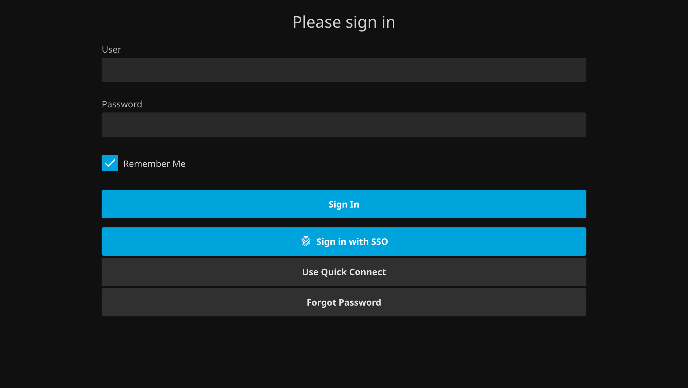
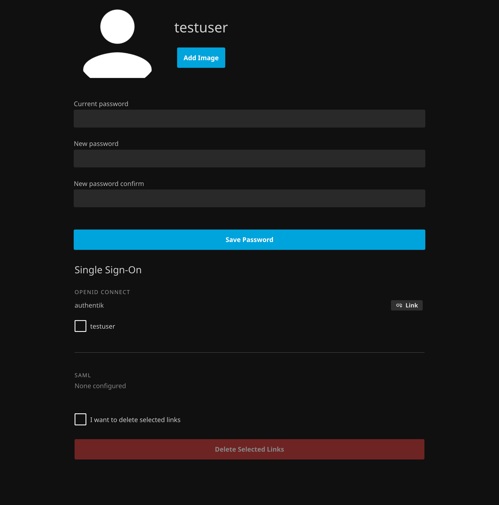

# Jellyfin SSO UI

This script aims to improve the [Jellyfin SSO Auth Plugin](https://github.com/9p4/jellyfin-plugin-sso) user experience within the Jellyfin web interface. 

While the backend SSO plugin is fine, it requires manual HTML/CSS branding for a login button and needs a separate, external-feeling page (`/SSOViews/linking`) to manage account links. This script integrates that functionality directly into the existing Jellyfin Web interface.

## Features
- **SSO Login Button**: Injects a "Sign in with SSO" button on the login page (no need for hacky manual branding).
- **Integrated Self-Service**: Implements all functionality of the plugin's linking page (`/SSOViews/linking`) directly in the **User Profile** settings. Users can link and unlink accounts without ever leaving the main Jellyfin UI.
- **Native Look & Feel**: Uses the internal Jellyfin components to match the server theme perfectly.

## Installation

### Prerequisites
This script requires a Jellyfin server with the SSO plugin ([jellyfin-plugin-sso](https://github.com/9p4/jellyfin-plugin-sso)) installed and configured.

### Method 1: Injecting using Jellyfin-JavaScript-Injector (Recommended)
0. Ensure your setup is supported ([Check Supported Versions](#supported-versions))
1. Install [Jellyfin-JavaScript-Injector](https://github.com/n00bcodr/Jellyfin-JavaScript-Injector).
2. Navigate to **Dashboard > JS Injector** in the Plugins section on the sidebar.
3. Add a new script and name it (e.g., "SSO UI").
5. Review the constants at the top of the script so that they match your setup. ([Check for details](#configuration))
6. Paste the script into the code field.
7. Ensure the script is enabled.
8. Click **Save** at the bottom of the page.

### Method 2: Browser Extension
You can use a browser extension like **Tampermonkey** or **Violentmonkey** to inject the script locally into your browser session.

## Configuration

The script contains a constant at the top to define your primary SSO entry point (used for the login button):

```javascript
const SSO_URL = "/sso/OID/start/authentik";
```

Update this string to match your provider's specific OID or SAML start path as configured in your Jellyfin SSO plugin settings.

## Screenshots

### Login Page Patch
The script injects a "Sign in with SSO" button inside the login form, matching the native Jellyfin button styling and primary theme colors.



### User Profile Patch
Within the **Settings > Profile** page, a new "SSO Accounts" section is added. This allows users to view linked providers and manage their external identity links without leaving the application.



## Caveats

> [!WARNING]
> Using versions outside of those listed below may result in unexpected UI behavior or broken functionality due to changes in Jellyfin's internal DOM structure or the SSO plugin's API schema.

- **Admin Impersonation Limitation**: When an administrator edits another user's profile via **Dashboard > Users > Edit User > "Edit this user's profile, image and personal preferences."**, the "SSO Accounts" section will still display and affect the **administrator's** own SSO links, not the links of the user being edited.
- **DOM Sensitivity**: Because this script relies on a `MutationObserver` to inject elements into the Jellyfin SPA, major updates to the Jellyfin web client may require script updates.
- **Provider Paths**: Ensure your `SSO_URL` matches your specific provider; otherwise, the login button will return a 404 or a plugin error.

### Supported Versions
The following versions were used for development and testing:

| Component | Version | Comment |
| :--- | :--- | :--- |
| Jellyfin [jellyfin/jellyfin](https://github.com/jellyfin/jellyfin) | 10.11.4 | Stable on 10.11.x releases |
| SSO-Auth [9p4/jellyfin-plugin-sso](https://github.com/9p4/jellyfin-plugin-sso)| 4.0.0.3 | Needs further testing |
| JS Injector [n00bcodr/Jellyfin-JavaScript-Injector](https://github.com/n00bcodr/Jellyfin-JavaScript-Injector)| 3.2.0.0 | High compatibility expected |

## Technical Details

- **API Interaction**: Uses the native `ApiClient` global object to fetch provider names via `sso/OID/GetNames` and `sso/SAML/GetNames`.
- **Dynamic Injection**: Uses a `MutationObserver` to watch for DOM changes, ensuring the SSO buttons and sections appear even when navigating Jellyfin's Single Page Application (SPA) architecture.
- **Theming**: Dynamically references Jellyfin CSS variables like `--theme-primary-color` and `--alert-text-color` to ensure the UI looks correct in Dark, Light, and custom themes.
